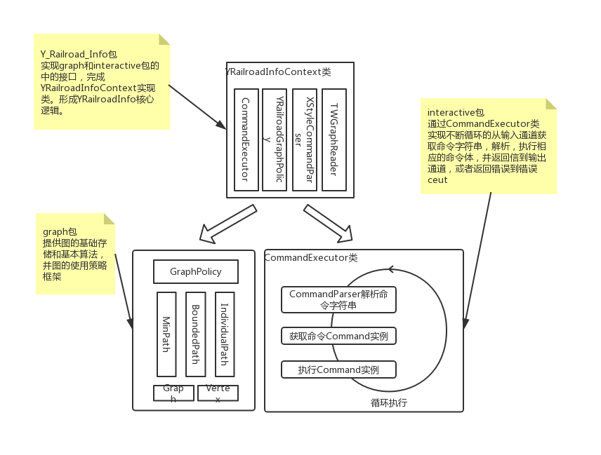

#概述

Y-railroad-info是一个简易版的通勤线路查询系统。该程序是个单机版，基于命令行的应用。可以查询已知路径的路程。指定起点和终点，能查询路程最短的路线数量及路程总长。或经停最少的路现数量及经停次数。也可以指定起点和终点，查询经停次数在一定数值范围，或者路程在一定范围的路线的条数及他们的路程、经停次数等。

# 使用方法

该程序采用java编写，基于gradle工具进行构建，测试等。可以在任意编程ide工具中，以导入gradle项目的方式导入该项目进行源码阅读或再次开发。

1. **编译**  
进入项目目录中，用命令行 gradle jar 进行编译打包成可执行jar包。最终生成结果为项目目录下的build/libs子目录中的Y-railroad-info.jar。  
<u>(由于在本项目的`SpecifiedPath`类中，调用了`Stream.iterate(T seed, Predicate<? super T> hasNext, UnaryOperator<T> next)`方法，所以要求编译的java版本至少为1.9)</u>  
当然你也可以运行别的gradle任务执行别的任务，比如执行单元测试等。  
 
2. **运行**  
得到了上一步的编译结果后，可以用 **java -jar Y-railroad-info.jar** 命令启动程序。  
完整的启动命令是 **java -jar Y-railroad-info.jar -data map.txt -exit quit**  
&emsp;&emsp;**map.txt**&emsp;&emsp;地图数据文本(每行一条信息.格式如 AB32, A、B分别代表一个节点，32为A到B的路程  
&emsp;&emsp;**quit**&emsp;&emsp;&emsp;&ensp;这里输入quit，程序的退出命令就是quit。默认为exit  
 
3. **操作**  
启动后，将进入Y-railroad-info的命令提示界面。  
在这个界面中，可以通过命令执行各种操作。  
当前版本提供了三条命令，help、dist、count。操作手册如下（可以在Y-railroad-info的命令提示界面中通过help命令获得）。  

#设计概览

本项目的架构设计，主要包括三个模块：**graph**、**interactive**、**impl.Y_Railroad_Info**。  
+ **graph**  
处于`yuan.interview.railroad.graph`包中图论相关的低层代码，包括图中顶点、有向边，边的权重等数据的存储及一些路径遍历算法，比如最短路径和路程值在一定数值范围的路径搜索。  
+ **interactive**  
处于`yuan.interview.railroad.interactive`包中。用户交互相关的框架。当前该模块是一个操作流程的规范框架：  
&emsp;&emsp;1.从输入通道读取命令  
&emsp;&emsp;2.命令解析  
&emsp;&emsp;3.根据解析结果调用相应命令执行体的并把结果传递给输出通道，如遇执行错误，将错误信息输出到到错误输出通道。  
+ **impl.Y_Railroad_Info**  
处于`yuan.interview.railroad.impl.Y_Railroad_Info`包中。
基于以上两个模块实现的具体应用。这里只实现了一个关于**Y_Railroad_Info**的系统，并放置于	Y_Railroad_Info	子包中（后期迁移出来做为独立的系统）。

如下为架构简述图  

#补充

这是一个以ThoughtWorks java岗位第二轮面试homework的问题1----Problem one:Trains为背景设置的应用。  
题目中的10个要求用例分别是：
>The distance of the route A-B-C.  
The distance of the route A-D.  
The distance of the route A-D-C.  
The distance of the route A-E-B-C-D.  
The distance of the route A-E-D.  
The number of trips starting at C and ending at C with a maximum of 3 stops.  In the sample data below, there are two such trips: C-D-C (2 stops). and C-E-B-C (3 stops).  
The number of trips starting at A and ending at C with exactly 4 stops.  In the sample data below, there are three such trips: A to C (via B,C,D); A to C (via D,C,D); and A to C (via D,E,B).  
The length of the shortest route (in terms of distance to travel) from A to C.  
The length of the shortest route (in terms of distance to travel) from B to B.  
The number of different routes from C to C with a distance of less than 30.  In the sample data, the trips are: CDC, CEBC, CEBCDC, CDCEBC, CDEBC, CEBCEBC, CEBCEBCEBC.  

在**Y_Railroad_Info**界面中，可以依次执行以下10条命令得到结果：  
>dist -p A-B-C  
dist -p A-D  
dist -p A-D-C  
dist -p A-E-B-C-D  
dist -p A-E-D  
count -f s -b C -e C -M 3  
count -f s -b A -e C -m 4 -M 4  
dist -f md -b A -e C  
dist -f md -b B -e B  
count -f d -b C -e C -M n30  

或者通过执行本项目的单元测试类`yuan.interview.railroad.impl.Y_Railroad_Info.YRailroadInfoContextTest`，验证结论。
或者通过测试代码目录中`yuan.interview.railroad.graph.algorithm`包里的单元测试观察更更具体的执行信息。